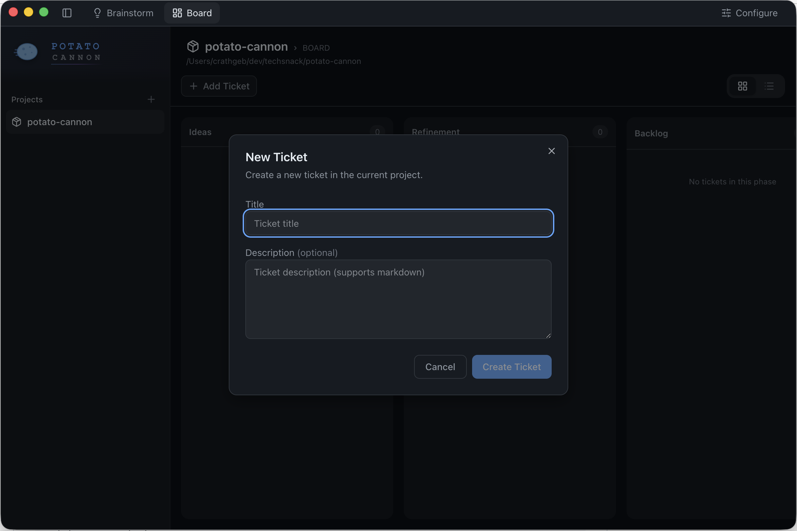

# Potato Cannon

Multi-agent software engineering daemon for autonomous development pipelines. Potato Cannon orchestrates Claude Code sessions through configurable workflow phases, enabling adversarial review loops, task-based execution, and human-in-the-loop feedback.



## What It Does

Potato Cannon turns your feature requests into working code through a structured pipeline:

1. **Brainstorm** - Chat with an AI agent to explore ideas and refine requirements
2. **Refine** - Agent analyzes requirements with adversarial review until the spec is solid
3. **Architect** - Agent designs technical approach with peer review
4. **Specify** - Agent creates detailed implementation tasks
5. **Build** - Agent implements each task with automated verification loops
6. **Review** - Human reviews the completed work

Each phase uses specialized Claude Code agents. Review loops catch issues early. Tasks isolate changes in git worktrees. Everything is tracked in the dashboard.

## Desktop App (Recommended)

The desktop app is the preferred way to use Potato Cannon. It bundles the daemon and UI into a native application with menu bar integration.

### Download

Download the latest release for your platform from the (coming soon):

| Platform | Download                                         |
| -------- | ------------------------------------------------ |
| macOS    | `Potato Cannon.dmg` or `Potato Cannon.zip`       |
| Windows  | `Potato Cannon Setup.exe` or `Potato Cannon.zip` |
| Linux    | `Potato Cannon.AppImage` or `Potato Cannon.deb`  |

### Build from Source

```bash
# Prerequisites: Node.js >= 18, pnpm >= 8, Claude Code CLI

# Clone and install
git clone https://github.com/crathgeb/potato-cannon.git
cd potato-cannon
pnpm install

# Build everything (daemon, frontend, and desktop app)
pnpm build

# Find the built app in apps/desktop/release/
# macOS: Potato Cannon.app, .dmg, .zip
# Windows: .exe installer, .zip
# Linux: .AppImage, .deb
```

### Getting Started

1. Launch Potato Cannon from your Applications folder
2. The app initializes `~/.potato-cannon/` on first run
3. Register your project via the dashboard (click "+" or use File → Register Project)
4. Select your project from the sidebar
5. Click "New Brainstorm" to start exploring an idea
6. Chat with the agent to refine your requirements
7. When ready, the agent creates a ticket and moves it through the pipeline

## CLI Installation (Alternative)

If you prefer running Potato Cannon as a background service without the desktop app:

### Prerequisites

- Node.js >= 18.0.0
- pnpm >= 8.0.0
- Claude Code CLI installed (`npm install -g @anthropic-ai/claude-code`)
- macOS or Linux

### Installation

```bash
# Clone and install
git clone https://github.com/crathgeb/potato-cannon.git
cd potato-cannon
pnpm install

# Build
pnpm build
```

### Running

```bash
# Start the daemon (creates ~/.potato-cannon/ on first run)
# Web UI available at http://localhost:8443
potato-cannon start

# Or run in development mode with hot reload
pnpm dev
```

### Usage

1. Open http://localhost:8443 in your browser
2. Select your registered project
3. Click "New Brainstorm" to start exploring an idea
4. Chat with the agent to refine your requirements
5. When ready, the agent creates a ticket and moves it through the pipeline

## Architecture

```
┌─────────────────────────────────────────────────────────────────┐
│                           Daemon                                 │
│  ┌─────────────┐  ┌─────────────┐  ┌─────────────────────────┐  │
│  │ Web UI      │  │ REST API    │  │ Chat Providers          │  │
│  │ React SPA   │  │ /api/*      │  │ (Telegram, ...)         │  │
│  └─────────────┘  └─────────────┘  └─────────────────────────┘  │
│                          │                     │                 │
│                   ┌──────┴──────┐              │                 │
│                   │ Session     │◄─────────────┘                 │
│                   │ Orchestrator│                                │
│                   └──────┬──────┘                                │
└──────────────────────────┼──────────────────────────────────────┘
                           │ PTY + MCP
                           │
                    Claude Code Sessions
```

### Components

| Component          | Description                                                                         |
| ------------------ | ----------------------------------------------------------------------------------- |
| **Daemon**         | Express server managing projects, tickets, sessions, and the Claude Code plugin     |
| **Web UI**         | React dashboard for kanban board, ticket details, brainstorm chat, and session logs |
| **MCP Proxy**      | Bridge between Claude Code and daemon for tools like `chat_ask`, `create_task`      |
| **Chat Providers** | Telegram integration for mobile notifications and responses                         |

### Workflow Execution

Workflows define phases with nested workers:

- **agent** - Single Claude Code session with specific instructions
- **ralphLoop** - Adversarial review: iterate until approved or max attempts
- **taskLoop** - Process each task through nested workers

Example: A Build phase might have a `taskLoop` containing a `ralphLoop` with builder and verifier agents.

## CLI Commands

```bash
potato-cannon start             # Start daemon (default port 8443)
potato-cannon start --port 9000 # Start on custom port
potato-cannon start --daemon    # Run in background
potato-cannon status            # Check if daemon is running
potato-cannon stop              # Stop daemon
```

## Configuration

Configuration is stored at `~/.potato-cannon/config.json`:

```json
{
  "telegram": {
    "botToken": "your-bot-token",
    "userId": "your-telegram-user-id",
    "forumGroupId": "optional-forum-group-id"
  },
  "daemon": {
    "port": 8443
  }
}
```

### Telegram Setup (Optional)

1. Create a bot via [@BotFather](https://t.me/botfather)
2. Get your user ID from [@userinfobot](https://t.me/userinfobot)
3. Add credentials to `~/.potato-cannon/config.json`

## Development

```bash
# Install dependencies
pnpm install

# Development mode (daemon + frontend with hot reload)
pnpm dev

# Or run individually
pnpm dev:daemon      # Daemon with file watching
pnpm dev:frontend    # Vite dev server
pnpm dev:desktop     # Electron app

# Build
pnpm build           # Build all packages
pnpm typecheck       # TypeScript check

# Test
pnpm test            # Run all tests
```

### Project Structure

```
apps/
├── daemon/           # Express server, MCP tools, SQLite stores
├── frontend/         # React 19, Vite, TanStack Router/Query, Tailwind
└── desktop/          # Electron wrapper

packages/
└── shared/           # TypeScript types and constants
```

## Customization

### Workflow Templates

Templates define the phase sequence and agent behavior. The default `product-development` template includes:

- Ideas, Refinement, Architecture, Specification, Build, Review, Done phases
- Agent prompts in `templates/workflows/product-development/agents/`
- Configurable worker trees with ralph loops and task loops

Create custom templates by copying and modifying the default.

### Agent Overrides

Customize agent behavior per-project without modifying templates:

```bash
# Create override file
cp ~/.potato-cannon/templates/product-development/agents/builder.md \
   ~/.potato-cannon/project-data/{projectId}/template/agents/builder.override.md

# Edit the override with project-specific instructions
```

## Requirements

- **Platform**: macOS, Windows, or Linux (desktop app); macOS or Linux (CLI)
- **Claude Code** CLI installed and authenticated
- For building from source: Node.js >= 18.0.0, pnpm >= 8.0.0

## License

Potato Cannon is [fair-code](https://faircode.io) distributed under the [Sustainable Use License](LICENSE.md) and the [Potato Cannon Enterprise License](LICENSE_EE.md).

- **Sustainable Use License**: Free for internal business use, personal use, and non-commercial distribution
- **Enterprise License**: Required for enterprise features (files in `apps/*/enterprise/` directories)

See [LICENSE.md](LICENSE.md) for full terms.
